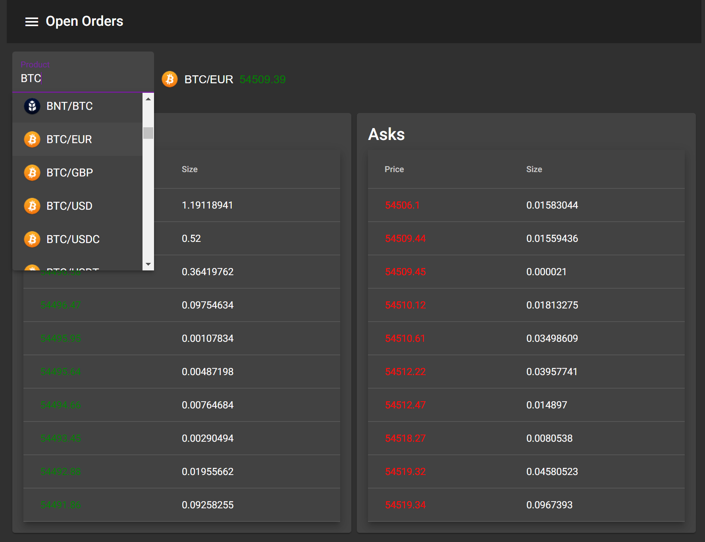

# Market Data

Demo app that displays cryptocurrency order book in realtime

An Isomorphic Web Application using Typescript

## Demo

[Live Demo (AWS)](http://market-data-client.s3-website-us-east-1.amazonaws.com/)

## Tech Stack

- [Angular / Typescript / RxJS](https://angular.io)
  - Angular / Typescript / RxJS
- [NestJS](https://nestjs.com/)
  - NodeJS Framework / Typescript
- [Angular Material](https://material.angular.io/m)
  - Material Design components for Angular
- [Angular Flex Layout](https://github.com/angular/flex-layout)
  - Reactive Layout / Flexbox CSS
- [Coinbase API](https://developers.coinbase.com/api/v2g)
  - REST API / Websockets
- [Crypto Icons](http://cryptoicons.co/)
  - Free Cryptocurrency icons

## Tooling and Deployment

- Frontend is deployed on AWS S3 with the help of [Serverless](https://www.serverless.com/)
- Backend is deployed on AWS Lambda with the help of [SWS S3 CLI](https://docs.aws.amazon.com/cli/latest/reference/s3/)
- Dev / Build Tool using [Nx](https://nx.dev)

